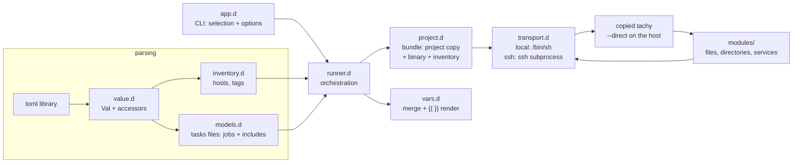

# tachy

Full reference: [DOCUMENTATION.md](DOCUMENTATION.md).

TOML-driven configuration management for D — a small, boring, Ansible-like
(files, directories, services) addressed by target; tachy applies it to the
hosts selected from an **inventory**, over SSH or locally. The tasks file's
parent directory is its **project**: tachy copies the project — and itself —
to each host and runs it there. Current state is inspected first, and
actions run only when reality differs from the desired one — running twice
changes nothing the second time.

```
tachy '@web'            # applies main.toml; its directory is the project
```

## Features

- **Inventory**: hosts with connection details, tags and variables.
- **Tasks files**: `[files]`, `[directories]`, `[services]` tables keyed by
  path or unit name — the target *is* the key. Two equivalent spellings.
- **Projects**: the tasks file's parent directory is the project; tachy
  copies it (plus the tachy binary) to a temporary bundle on every host
  and executes the composition there. A tasks file argument may be a
  directory — its `main.toml` is the entry point — and with no tasks
  file argument, `main.toml` in the current directory is used.
- **Composition**: tasks files compose other tasks files through
  `[includes]` (runs before the file's own jobs) and `[apply]` (runs
  after), each entry carrying its own variables; scopes chain and
  flow forward.
- **Variables** with precedence and `{{ name }}` / `{{ table.key }}`
  templating, including variables referencing other variables
  (cycle-detected).
- **Selection**: comma-separated host names and `@tag` selectors as the
  first CLI argument; `inventory.toml` is the default inventory.
- Transports: `local` (`/bin/sh`) and `ssh` (spawns `ssh`; bundles are
  shipped as a tar stream and file content over stdin — the host needs
  nothing but GNU coreutils and tar).
- Check mode (`--check`): dry-run that reports would-be changes without
  applying anything.
- Strict validation everywhere: unknown keys, undefined variables, invalid
  states, duplicate targets, include cycles, includes escaping the
  project and unknown hosts/tags are reported with file context before
  anything touches a machine.
- Per-host failure isolation: a failing host is dropped from the rest of its
  tasks file; other hosts continue; exit code 1 if anything failed.

## Build

Requires [DMD](https://dlang.org) and [dub](https://code.dlang.org).

```sh
dub build          # produces ./tachy
dub test           # unit tests for all layers
```

The only dependency is the [`toml`](https://code.dlang.org/packages/toml)
parser library.

## Example usage

A small site setup, applied to everything tagged `web`. The tasks file and
everything it needs live in one **project** directory:

```text
site/
├── main.toml          # entry point (the default tasks file name)
├── base.toml          # a reusable building block
└── files/
    └── index.tmpl     # rendered source: template = "files/index.tmpl"
```

**`site/main.toml`** — composes the base and adds jobs; both table
spellings are shown

```toml
[vars]
domain = "example.org"

[includes."base.toml"]
site_name = "main"

[files."{{ doc_root }}/index.html"]
template = "files/index.tmpl"
mode = "0644"

[files]
"{{ doc_root }}/robots.txt" = { content = "User-agent: *\n", mode = "0644" }

[services.nginx]
state = "started"
enabled = true
```

**`site/base.toml`** — a reusable building block

```toml
[vars]
doc_root = "/srv/www"

[directories."{{ doc_root }}"]
mode = "0755"
```

**`inventory.toml`** (the default inventory file) — kept in the project or
next to it:

```toml
[vars]                       # global variables, lowest precedence
site_owner = "tachy"

[hosts.web1]
address = "192.168.1.10"     # default: the host name
user = "deploy"              # ssh user
# port = 22                  # ssh port (default 22)
# key  = "~/.ssh/id_ed25519" # identity file (default: ssh's default)
tags = ["web", "front"]      # selection: tachy '@web' ...
[hosts.web1.vars]
http_port = 8081

[hosts.web2]
address = "192.168.1.11"
tags = ["web"]
[hosts.web2.vars]
http_port = 8082

[hosts.buildbox]
connection = "local"         # manage this machine itself
```
Run it — the first argument is the host selection (a comma-separated list of
host names and `@tag`s; `all` matches everything). A tasks file argument
may be a directory (its `main.toml` is the entry point); with no tasks
file, `main.toml` in the current directory is used. Either way, tachy
copies the whole project and itself to each host and executes it there:

```sh
$ cd site && tachy '@web'
== main.toml | hosts: web1, web2
web1 | changed         | directory /srv/www: created directory
web1 | changed         | file /srv/www/index.html: created file
web1 | changed         | file /srv/www/robots.txt: created file
web1 | changed         | service nginx: enabled, started
web2 | changed         | directory /srv/www: created directory
web2 | changed         | file /srv/www/index.html: created file
web2 | changed         | file /srv/www/robots.txt: created file
web2 | changed         | service nginx: enabled, started
-- main.toml: ok=4 changed=8 failed=0

$ tachy '@web'                    # second run: nothing to do
-- main.toml: ok=8 changed=0 failed=0
```

Note that the main file's jobs use `{{ doc_root }}` even though it is
defined inside the included `base.toml` — includes run first and their
variables flow forward to the includer. Host variables (`http_port`) and
global ones (`site_owner`) travel to each host in a generated one-host
inventory inside the temporary bundle. `template = "files/index.tmpl"`
renders that source on the host with the same scope before it is
compared and written; `src` would copy it verbatim instead.

Drift is detected and repaired — and previewed first with `--check`:

```sh
$ echo tampered | ssh deploy@192.168.1.10 tee -a /srv/www/index.html >/dev/null
$ tachy -c '@web' main.toml       # dry run
web1 | changed (check) | file /srv/www/index.html: updated content
-- main.toml: ok=7 changed=1 failed=0 (check mode, nothing applied)
$ tachy '@web' main.toml          # repair
web1 | changed         | file /srv/www/index.html: updated content
```

Other useful invocations:

```sh
tachy '@web' ~/site/main.toml              # explicit entry file
tachy '@web,buildbox'                      # tags and names mix freely
tachy web2 site                           # a single host by name; directory
                                          # argument → its main.toml
tachy -v '@web'                            # show executed commands
tachy -i staging.toml '@web' main.toml     # a non-default inventory
tachy '@web' base.toml extra.toml          # several tasks files, in order
tachy --help                               # full reference
```

(All of these assume the project layout above; `tachy '@web'` uses
`main.toml` in the current directory.)

## CLI reference

```
tachy [options] <selection> [<tasks.toml>...]

  <selection>   comma-separated host names and @tags, or "all"
  <tasks.toml>  optional; may also be a directory, in which case its
                "main.toml" is the entry point. With none, "main.toml"
                in the current directory is used. The parent directory of
                each tasks file is its project: it is copied to every
                selected host (temporary location) together with the
                tachy binary, which is executed there (over ssh, or
                locally for connection = "local" hosts). linux/amd64 only.

  -i, --inventory PATH   Inventory file (default: inventory.toml)
  -c, --check            Check mode: report changes without applying them
  -v, --verbose          Show executed commands and change details
      --list-hosts       List hosts matching the selection, then exit
      --direct           Run tasks files directly in this process, without
                         bundling a project (how the on-host copy runs)
      --direct-report P  With --direct: write "ok changed failed" to P
      --events           Print one JSON event per line on stdout instead
                         of text (machine mode): with --direct, the local
                         run's own events; otherwise the raw events
                         streamed live from each host
      --color            Force colored statuses when stdout is not a tty
  -h, --help             Show this help
```

Exit code is `1` when any job failed or configuration is invalid, `0`
otherwise. Multiple tasks files run in order; a host that fails inside one
file is retried in the next.

## Configuration reference

### Inventory

| Section | Keys | Meaning |
|---|---|---|
| `[hosts.NAME]` | `address`, `user`, `port`, `key`, `connection`, `tags`, `vars` | One host. `connection` is `"ssh"` (default) or `"local"`; `address` defaults to the host name; `tags` drive `@tag` selection. |
| `[vars]` | — | Global variables. Entries may be `{ env = "NAME", default = "...", from = ".env" }` to read the controller's environment or a dotenv file (per-host `[hosts.NAME.vars]` too). |

### Tasks file

Top-level tables (all optional):

| Table | Entries | Entry keys |
|---|---|---|
| `[vars]` | — | Variables for this file's jobs and everything it composes. Entries may be `{ env = "NAME", default = "...", from = ".env" }` to read the environment of the process loading the file (the host, in bundled runs) or a dotenv file relative to it. |
| `[apply]` | path → vars | Same as `[includes]` (including the `vars = { ... }` spelling), but the applied file's jobs run **after** this file's own jobs, respecting the order of execution of the directives. |
| `[directories]` | path → params | `state` (default `directory`; also `absent`), `mode`, `owner`, `group` |
| `[services]` | unit → params | `state` (`started`, `stopped`, `restarted`, `reloaded`, or `enabled` = ensure boot enablement only), `enabled` (bool), `src`/`template` (manage the unit file at `/etc/systemd/system/<unit>`: verbatim copy or rendered template; mutually exclusive), `vars` (local template context, with `template` only). |
| `[packages]` | `"<manager>:<name>"` → params | `version` (default `latest`; an explicit version pins it exactly — epoch-qualified, as dpkg reports it), `present` (default `true`; `false` removes). Only `apt` keys are supported. |
| `[groups]` | name → params | `state` (default `present`; `absent` removes). |
| `[users]` | name → params | `group` (primary; default: a group named after the user), `groups` (supplementary, additive only), `shell` (default `/bin/sh` at creation), `comment`, `create_home` (default `true`, creation only), `home` (default `/home/<name>` at creation), `state` (default `present`; `absent` removes), `remove_home` (default `false`, with `state = "absent"`). |
| `[execute]` | name → params | `run` (required), `exit_status` (integer, `{ not = N }`, or `{ cond = "OP N" }`; default 0), `output` (string, `{ contains = "..." }`, or `{ matches = "..." }`) |
| `[before.G]` / `[after.G]` | name → params | Hooks wrapping a job group `G` — `packages`, `accounts` (groups + users) or `services`: `[execute]`-style checks (`run`, `exit_status`, `output`) keyed by unique task name, running at the group's position in the file's order whether or not the group has entries. |

Both spellings of a keyed entry are equivalent:

```toml
[files."/tmp/myfile"]           # sub-table style
owner = "root"
mode = "0600"

[files]                         # inline-table style
"/tmp/myfile" = { owner = "root", mode = "0600" }
```

In table headers the quotes around a path key are optional: dots after
the first non-`bare` segment belong to the path, so
`[files./tmp/myfile.txt]` means exactly `[files."/tmp/myfile.txt"]`.

Inline tables may also span several lines — newlines inside an unclosed
inline table are treated as element separators, so this is the same
entry as the sub-table style above:

```toml
[files]
"/tmp/myfile" = {
  owner = "root"
  mode = "0600"
}
```

Idempotency semantics:
- `[files]` + `content`/`src`/`template`: compares current content,
  writes only on difference. `content` is templated inline; `src` copies
  the named file verbatim; `template` renders the named file's
  `{{ vars }}` with the host's scope first. The three are mutually
  exclusive sources. `state = "link"` makes the key a symlink to `src`;
  `state = "absent"` removes whatever is there.
- `[files]` + `line`/`block`: ensures a line (or a contiguous block of
  lines) is present — whole-line matches anywhere in the file; appends
  it (newline-terminated) only when missing. `line` and `block` are
  mutually exclusive, and exclusive with `content`/`src`/`template`. Without
  any of them, only ensures existence.
- `[packages]`: keys are `"<manager>:<name>"` (only `apt`). Presence is
  probed read-only with `dpkg-query`; mutations run
  `apt-get install -y` / `remove -y` with `DEBIAN_FRONTEND=noninteractive`
  so installs never block on prompts. `version = "latest"` (the default)
  only ensures presence — newer candidates are not looked for; an explicit
  version is compared exactly against dpkg's `${Version}` and repaired
  with `--allow-downgrades`.
- `[groups]`: `groupadd` when missing, `groupdel` when present and
  `state = "absent"`. Removing a group that is still a user's primary
  group fails with a hint (remove the user first — e.g. in an earlier
  tasks file).
- `[users]`: shadow-utils accounts. Missing users are created with the
  declared attributes (creation defaults: shell `/bin/sh`, home
  `/home/<name>`, home created); existing users have their *explicitly
  set* attributes enforced — primary group, shell, comment and home
  drift is repaired with a single `usermod` (`-m -d` moves the home).
  `groups` is additive: missing memberships are added, others kept.
  `state = "absent"` runs `userdel` (`-r` with `remove_home = true`).
  Existence is probed with `getent`, so the target needs glibc
  alongside coreutils.
- `[services]`: queries `systemctl is-active` / `is-enabled` and acts only
  on mismatch (`started`/`stopped`/`enabled`); `restarted`/`reloaded`
  always act. `state = "enabled"` ensures boot enablement without touching
  the running state. `src` or `template` manage the unit file itself at
  `/etc/systemd/system/<unit>` (`.service` appended when the name has no
  suffix): rendered with the host scope plus the entry's local `vars`
  (`template`), or copied verbatim (`src`); checksum-compared, written and
  `daemon-reload`ed on drift — a running service is not restarted (use
  `state = "restarted"` to apply a new unit).
- `[execute]`: runs `run` on the host and checks it — `exit_status`
  accepts an integer, `{ not = N }` or `{ cond = "OP N" }` with `OP`
  one of `==`, `!=`, `<`, `<=`, `>`, `>=` (default `0`); `output`
  accepts a string (exact match on the trimmed output),
  `{ contains = "..." }` or `{ matches = "regex" }`. A passing job
  reports `ok` (never `changed`); a failed assertion fails the host
  with the actual status/output. Execute jobs are checks by nature:
  they run even in check mode, so keep mutating commands out of them.
  The command runs with the defining tasks file's directory as its
  working directory, so relative paths (scripts, data files) resolve
  next to the file that declares the job.
- Hooks `[before.G]` / `[after.G]` (`G`: `packages`, `accounts`, `services`):
  `[execute]`-style checks triggered at a specific point of the file's
  execution order — immediately before/after the file's jobs of that
  group (accounts covers `[groups]` + `[users]`). They run whether or
  not the group has entries, so the composition entry file can
  health-check what its includes managed.

Execution order is deterministic: a file's includes first (sorted by path,
recursively), then its own jobs (directories, files, packages, groups,
users, services, execute — by key within each kind), then its applies
(sorted by path, recursively). Directories run before files (a file may
live inside a directory the same file manages); packages run after both,
so the apt repository config and keyring can be laid down first; groups
run before users so a user's primary group can be ensured in the same
file; removing both requires dropping the user in an earlier tasks file
(shadow-utils refuses to delete a group that is still a primary group,
and tachy surfaces that with a hint).

Managing the same (kind, target) twice anywhere in a composition is a
load-time error.

A project must be self-contained: includes escaping the tasks file's
parent directory are a load-time error, and `file.src` resolves inside
the copied project (a `src` outside the project cannot be read on the
host). Bundles are created with `mktemp -d` under `TMPDIR` (or `/tmp`)
on the host and removed when the run finishes — `--keep-bundle` leaves
them in place and prints their location, for inspection.

### Variables and templating

Precedence, lowest to highest, scopes chaining through the composition
graph (`[includes]` and `[apply]` behave identically):

```
inventory [vars]  <  host vars  <  outer file vars  <  directive vars
                 <  composed file's own [vars]
```

The resulting scope flows forward: a file's own jobs see everything its
includes contributed (they run first); applies contribute to later
applies and to the file's exported scope, but not to its own jobs
(those already ran). A directive entry's keys are its variable binding;
a `vars = { ... }` sub-table is an equivalent, grouped spelling:

```toml
[apply."files.toml"]
vars = { three = "three" }
```

Binding the same variable both directly and under `vars` is an error.
Every string in job parameters (including table
keys) is rendered before execution; `{{ expr }}` accepts dotted paths into
nested tables. Unknown variables and reference cycles are hard errors.
`{{ inventory_hostname }}` is always the current host's name. Deep merge:
nested tables merge key by key; arrays and scalars replace.

Environment variables can be stored into tachy's variables with an
`{ env = "NAME" }` entry, replaced at load time by the variable's value.
An optional `default` covers an unset variable — it only errors when
there is no value and no default. A `from = "<path>"` attribute reads
the value from a dotenv file instead of the process environment:

```toml
[vars]
api_token = { env = "API_TOKEN" }
log_level = { env = "LOG_LEVEL", default = "info" }
secret_var = { env = "SECRET_VAR", from = ".env" }   # KEY=VALUE lookup in .env
```

The `from` path is relative to the file declaring the `[vars]` (the
inventory or tasks file). The dotenv format is `KEY=VALUE` lines with
`#` comments, blank lines, an optional `export ` prefix and single-line
quoted values (double quotes process the usual escapes, single quotes
are literal); an empty value is a value, later keys win, and anything
else is an error naming file and line. The `default` still applies —
it covers a key the file does not define.

Inventory `[vars]` (global and per-host) resolve in the controller's
environment; tasks-file `[vars]` resolve in the environment of the
process that loads them — the host, in bundled runs, so the same
project can pick up per-host values. With `from`, the file is read in
that same place: for bundled tasks files it must live inside the
project (the bundle copies it along). A set-but-empty variable resolves
to the empty string (the default only covers an unset variable). Nested
tables are walked; arrays and scalars pass through unchanged.

## Architecture



Two levels of tachy run per invocation: the controller validates the
composition, then for each host deploys a temporary bundle (project copy,
binary copy, generated one-host inventory with the host's effective
variables) and executes the copied binary there; the on-host copy applies
every job through a local transport and reports per-job lines plus an
"ok changed failed" counter file the controller aggregates. `--direct`
skips the bundling and runs jobs in-process (that is what the on-host
copy runs as).

1. **Parse & validate** — every TOML file goes through `value.d` into a
   uniform `Val` tree (datetimes rejected). `inventory.d` and `models.d`
   validate structure, keys, states, duplicate targets, include cycles and
   includes escaping the project up front, so a typo fails before any host
   is contacted. A tasks file flattens into an ordered `Job[]`, each job
   carrying its variable overlay (the include-chain scope it was defined
   in).
2. **Select** — `runner.d` resolves the selection argument (host names,
   `@tags`, `all`) through the inventory; unknown names or tags error with
   the list of the known ones.
3. **Bundle** — per host, `project.d` deploys the temporary bundle through
   the host's transport: a tar stream of the project, the running binary
   via `cat > tachy` + `chmod`, and a generated one-host inventory
   (host variables serialized back to TOML). Bundles are cached per
   (host, project) and removed at the end of the run.
4. **Execute** — the controller runs the bundled binary on the host
   (`cd project && tachy --direct ...`), which renders each job's
   parameters against the host scope and dispatches to its module
   (`filemod` / `servicemod` / `executemod`) with a `TaskContext` (local
   transport, check-mode flag, host name, defining file's dir for
   relative `src`).
   Modules express everything as POSIX shell commands; `transport.d`
   runs them and returns captured stdout/stderr/exit-status. File
   content is streamed through stdin (`cat > path`). The inner run's
   per-job lines are relayed and its counters aggregated from the report
   file. `--check` lets modules run read-only probes but blocks
   mutations; the bundle itself is scaffolding and is still deployed and
   removed in check mode.

Design notes:

- **One command language.** All state inspection (`stat -c '%F|%a|%U|%G'`,
  `systemctl is-active`, `cat`) and mutation (`mkdir`, `chmod`, `chown`,
  `ln`, `systemctl start`, …) are shell commands built with strict
  single-quoting (`shQuote`), so local and remote hosts share one code path
  and a GNU coreutils Linux target is the only remote assumption.
- **Failures are contained.** Any exception on a host (unreachable SSH,
  failed bundle deployment, failed command, render error) marks that host
  failed for the current tasks file and prints the failing job; remaining
  hosts continue.
- **Boring subprocess plumbing.** `std.process` with explicit pipes; stderr
  is drained on a thread so large stdout cannot deadlock; stdin is fed and
  closed for `runWithInput`; the project archive is produced by a local
  `tar` capturing stdout only.
- **No daemon, no agent versions.** The binary that runs on each host is
  a copy of the controller's own executable, so controller and hosts are
  always in lockstep (and must share the platform).

Source layout:

```
source/app.d                 CLI entry: selection, options, help, exit codes
source/tachy/
  errors.d                   TachyError (user-facing failures)
  value.d                    Val tree, TOML conversion, validated accessors
  vars.d                     deepMerge, {{ }} rendering, cycle detection
  inventory.d                hosts/tags model, selection, var resolution
  models.d                   tasks files: jobs, includes, scope chaining
  project.d                  bundles: project + binary + generated inventory
  transport.d                Transport interface, local/ssh, shell helpers
  runner.d                   orchestration: bundled and direct modes
  modules/
    package.d                registry, TaskContext/TaskResult, shared helpers
    filemod.d                files / directories / links / absent
    servicemod.d             systemd services
    accounts.d               groups / users (shadow-utils, getent probes)
    packagemod.d             package installs/removals (apt via dpkg-query)
    executemod.d             shell command checks (exit status / output)
    fake.d                   scripted transport (unit tests only)
```

Testing: `dub test` covers value conversion, merging/templating (including
cycles), inventory selection and precedence, tasks-file parsing (both
spellings, include layering, duplicate and cycle errors), quoting and
process plumbing, the file module against the real local filesystem, the
service module against a scripted transport, TOML re-serialization of host
variables, and full bundle deploy/remove over the local transport — no
systemd required for tests.

## Limitations

- linux/amd64 only: the binary copied to each host is the controller's own
  executable. Hosts also need GNU tar in addition to GNU coreutils and
  systemd, and a `TMPDIR` (or `/tmp`) that allows executing copied
  binaries.
- Targets must be Linux with GNU coreutils and systemd (the `services`
  table errors clearly on non-systemd hosts).
- SSH runs `ssh` with `BatchMode=yes` and
  `StrictHostKeyChecking=accept-new`; there is no password auth, agent
  forwarding, sudo escalation or parallelism (hosts run sequentially).
- The `toml` library rejects heterogeneous arrays (`[1, "a"]`).
- `[files]` with `content` follows symlinks when comparing/writing (no
  `follow`/`force` knobs yet); `mode`/`owner` are not applied to symlinks;
  `src` copies files verbatim — use `template = <path>` to render them.
