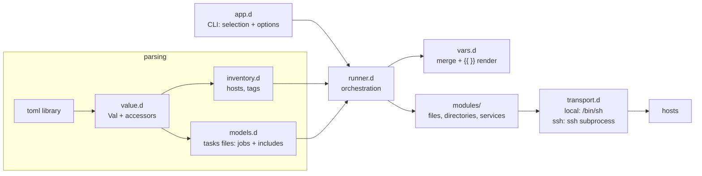

# tachy

TOML-driven configuration management for D — a small, boring, Ansible-like
automation tool. A **tasks file** is a list of idempotent "ensure" jobs
(files, directories, services) addressed by target; tachy applies it to the
hosts selected from an **inventory**, over SSH or locally. Current state is
inspected first, and actions run only when reality differs from the desired
one — running twice changes nothing the second time.

```
tachy '#web' tasks/site.toml
```

## Features

- **Inventory**: hosts with connection details, tags and variables.
- **Tasks files**: `[files]`, `[directories]`, `[services]` tables keyed by
  path or unit name — the target *is* the key. Two equivalent spellings.
- **Composition**: tasks files include other tasks files through
  `[includes]`, each include carrying its own variables; scopes chain and
  flow forward.
- **Variables** with precedence and `{{ name }}` / `{{ table.key }}`
  templating, including variables referencing other variables
  (cycle-detected).
- **Selection**: comma-separated host names and `#tag` selectors as the
  first CLI argument; `inventory.toml` is the default inventory.
- Transports: `local` (`/bin/sh`) and `ssh` (spawns `ssh`, streams file
  content over stdin — no agent, nothing to install on the target).
- Check mode (`--check`): dry-run that reports would-be changes without
  applying anything.
- Strict validation everywhere: unknown keys, undefined variables, invalid
  states, duplicate targets, include cycles and unknown hosts/tags are
  reported with file context before anything touches a machine.
- Per-host failure isolation: a failing host is dropped from the rest of its
  tasks file; other hosts continue; exit code 1 if anything failed.

## Build

Requires [DMD](https://dlang.org) and [dub](https://code.dlang.org).

```sh
dub build          # produces ./tachy
dub test           # unit tests for all layers
```

The only dependency is the [`toml`](https://code.dlang.org/packages/toml)
parser library.

## Example usage

A small site setup, applied to everything tagged `web`.

**`inventory.toml`** (the default inventory file)

```toml
[vars]                       # global variables, lowest precedence
site_owner = "tachy"

[hosts.web1]
address = "192.168.1.10"     # default: the host name
user = "deploy"              # ssh user
# port = 22                  # ssh port (default 22)
# key  = "~/.ssh/id_ed25519" # identity file (default: ssh's default)
tags = ["web", "front"]      # selection: tachy '#web' ...
[hosts.web1.vars]
http_port = 8081

[hosts.web2]
address = "192.168.1.11"
tags = ["web"]
[hosts.web2.vars]
http_port = 8082

[hosts.buildbox]
connection = "local"         # manage this machine itself
```

**`common/base.toml`** — a reusable building block

```toml
[vars]
doc_root = "/srv/www"

[directories."{{ doc_root }}"]
mode = "0755"
```

**`tasks/site.toml`** — composes the base and adds jobs; both table
spellings are shown

```toml
[vars]
domain = "example.org"

[includes."../common/base.toml"]
site_name = "main"

[files."{{ doc_root }}/index.html"]
content = """<html>{{ site_name }} from {{ inventory_hostname }} ({{ domain }})</html>
"""
mode = "0644"

[files]
"{{ doc_root }}/robots.txt" = { content = "User-agent: *\n", mode = "0644" }

[services.nginx]
state = "started"
enabled = true
```

Run it — the first argument is the host selection (a comma-separated list of
host names and `#tag`s; `all` matches everything):

```sh
$ tachy '#web' tasks/site.toml
== tasks/site.toml | hosts: web1, web2
web1 | changed         | directory /srv/www: created directory
web1 | changed         | file /srv/www/index.html: created file
web1 | changed         | file /srv/www/robots.txt: created file
web1 | changed         | service nginx: enabled, started
web2 | changed         | directory /srv/www: created directory
web2 | changed         | file /srv/www/index.html: created file
web2 | changed         | file /srv/www/robots.txt: created file
web2 | changed         | service nginx: enabled, started
-- tasks/site.toml: ok=4 changed=8 failed=0

$ tachy '#web' tasks/site.toml        # second run: nothing to do
-- tasks/site.toml: ok=8 changed=0 failed=0
```

Note that the main file's jobs use `{{ doc_root }}` even though it is
defined inside the included `common/base.toml` — includes run first and
their variables flow forward to the includer.

Drift is detected and repaired — and previewed first with `--check`:

```sh
$ echo tampered | ssh deploy@192.168.1.10 tee -a /srv/www/index.html >/dev/null
$ tachy -c '#web' tasks/site.toml     # dry run
web1 | changed (check) | file /srv/www/index.html: updated content
-- tasks/site.toml: ok=7 changed=1 failed=0 (check mode, nothing applied)
$ tachy '#web' tasks/site.toml        # repair
web1 | changed         | file /srv/www/index.html: updated content
```

Other useful invocations:

```sh
tachy '#web,buildbox' tasks/site.toml        # tags and names mix freely
tachy web2 tasks/site.toml                   # a single host by name
tachy all tasks/site.toml                    # everything in the inventory
tachy --list-hosts '#front' tasks/site.toml  # show the selection, change nothing
tachy -v '#web' tasks/site.toml              # show executed commands
tachy -i staging.toml '#web' tasks/site.toml # a non-default inventory
tachy '#web' base.toml extra.toml            # several tasks files, in order
tachy --help                                 # full reference
```

Remember to quote `#tag` selectors — your shell treats `#` as a comment.

## CLI reference

```
tachy [options] <selection> <tasks.toml> [more tasks files...]

  <selection>   comma-separated host names and #tags, or "all"

  -i, --inventory PATH   Inventory file (default: inventory.toml)
  -c, --check            Check mode: report changes without applying them
  -v, --verbose          Show executed commands and change details
      --list-hosts       List hosts matching the selection, then exit
  -h, --help             Show this help
```

Exit code is `1` when any job failed or configuration is invalid, `0`
otherwise. Multiple tasks files run in order; a host that fails inside one
file is retried in the next.

## Configuration reference

### Inventory

| Section | Keys | Meaning |
|---|---|---|
| `[hosts.NAME]` | `address`, `user`, `port`, `key`, `connection`, `tags`, `vars` | One host. `connection` is `"ssh"` (default) or `"local"`; `address` defaults to the host name; `tags` drive `#tag` selection. |
| `[vars]` | — | Global variables. |

### Tasks file

Top-level tables (all optional):

| Table | Entries | Entry keys |
|---|---|---|
| `[vars]` | — | Variables for this file's jobs and everything it includes. |
| `[includes]` | path → vars | Path to another tasks file (relative to this file); the table body or inline table is that include's variable binding. |
| `[files]` | path → params | `state` (default `file`; also `link`/`absent`), `content`, `src`, `mode`, `owner`, `group` |
| `[directories]` | path → params | `state` (default `directory`; also `absent`), `mode`, `owner`, `group` |
| `[services]` | unit → params | `state` (`started`/`stopped`/`restarted`/`reloaded`), `enabled` |

Both spellings of a keyed entry are equivalent:

```toml
[files."/tmp/myfile"]           # sub-table style
owner = "root"
mode = "0600"

[files]                         # inline-table style
"/tmp/myfile" = { owner = "root", mode = "0600" }
```

Idempotency semantics:

- `[files]` + `content`/`src`: compares current content, writes only on
  difference; without them, only ensures existence. `state = "link"` makes
  the key a symlink to `src`; `state = "absent"` removes whatever is there.
- `[directories]`: creates with `mkdir -p`, then fixes `mode`/`owner`/
  `group` if they differ; `state = "absent"` removes recursively.
- `[services]`: queries `systemctl is-active` / `is-enabled` and acts only
  on mismatch (`started`/`stopped`/`enabled`); `restarted`/`reloaded`
  always act.

Execution order is deterministic: a file's includes first (sorted by path,
recursively), then its own jobs (files, directories, services — by key
within each kind). Managing the same (kind, target) twice anywhere in a
composition is a load-time error.

### Variables and templating

Precedence, lowest to highest, scopes chaining through the include graph:

```
inventory [vars]  <  host vars  <  outer file vars  <  include vars
                 <  included file's own [vars]
```

The resulting scope flows forward: an includer's own jobs see everything
its includes contributed. Every string in job parameters (including table
keys) is rendered before execution; `{{ expr }}` accepts dotted paths into
nested tables. Unknown variables and reference cycles are hard errors.
`{{ inventory_hostname }}` is always the current host's name. Deep merge:
nested tables merge key by key; arrays and scalars replace.

## Architecture



Passes:

1. **Parse & validate** — every TOML file goes through `value.d` into a
   uniform `Val` tree (datetimes rejected). `inventory.d` and `models.d`
   validate structure, keys, states, duplicate targets and include cycles
   up front, so a typo fails before any host is contacted. A tasks file
   flattens into an ordered `Job[]`, each job carrying its variable
   overlay (the include-chain scope it was defined in).
2. **Select** — `runner.d` resolves the selection argument (host names,
   `#tags`, `all`) through the inventory; unknown names or tags error with
   the list of known ones.
3. **Render** — per host, the host's variable scope is deep-merged with
   each job's overlay, and the job's parameters (path included) are
   templated lazily (`vars.d`), with cycle detection on
   variable-to-variable references.
4. **Execute** — each job dispatches to its module (`filemod` /
   `servicemod`) with a `TaskContext` (transport, check-mode flag, host
   name, defining file's dir for relative `src`). Modules express
   everything as POSIX shell commands; `transport.d` runs them locally or
   over SSH and returns captured stdout/stderr/exit-status. File content is
   streamed through stdin (`cat > path`), identical on both transports.
   `--check` lets modules run read-only probes but blocks mutations.

Design notes:

- **One command language.** All state inspection (`stat -c '%F|%a|%U|%G'`,
  `systemctl is-active`, `cat`) and mutation (`mkdir`, `chmod`, `chown`,
  `ln`, `systemctl start`, …) are shell commands built with strict
  single-quoting (`shQuote`), so local and remote hosts share one code path
  and a GNU coreutils Linux target is the only remote assumption.
- **Failures are contained.** Any exception on a host (unreachable SSH,
  failed command, render error) marks that host failed for the current
  tasks file and prints the failing job; remaining hosts continue.
- **Boring subprocess plumbing.** `std.process` with explicit pipes; stderr
  is drained on a thread so large stdout cannot deadlock; stdin is fed and
  closed for `runWithInput`.

Source layout:

```
source/app.d                 CLI entry: selection, options, help, exit codes
source/tachy/
  errors.d                   TachyError (user-facing failures)
  value.d                    Val tree, TOML conversion, validated accessors
  vars.d                     deepMerge, {{ }} rendering, cycle detection
  inventory.d                hosts/tags model, selection, var resolution
  models.d                   tasks files: jobs, includes, scope chaining
  transport.d                Transport interface, local/ssh, shell helpers
  runner.d                   per-selection × per-host orchestration
  modules/
    package.d                registry, TaskContext/TaskResult, shared helpers
    filemod.d                files / directories / links / absent
    servicemod.d             systemd services
    fake.d                   scripted transport (unit tests only)
```

Testing: `dub test` covers value conversion, merging/templating (including
cycles), inventory selection and precedence, tasks-file parsing (both
spellings, include layering, duplicate and cycle errors), quoting and
process plumbing, the file module against the real local filesystem, and
the service module against a scripted transport — no systemd required for
tests.

## Limitations

- Targets must be Linux with GNU coreutils and systemd (the `services`
  table errors clearly on non-systemd hosts).
- SSH runs `ssh` with `BatchMode=yes` and
  `StrictHostKeyChecking=accept-new`; there is no password auth, agent
  forwarding, sudo escalation or parallelism (hosts run sequentially).
- The `toml` library rejects heterogeneous arrays (`[1, "a"]`).
- `[files]` with `content` follows symlinks when comparing/writing (no
  `follow`/`force` knobs yet); `mode`/`owner` are not applied to symlinks.
