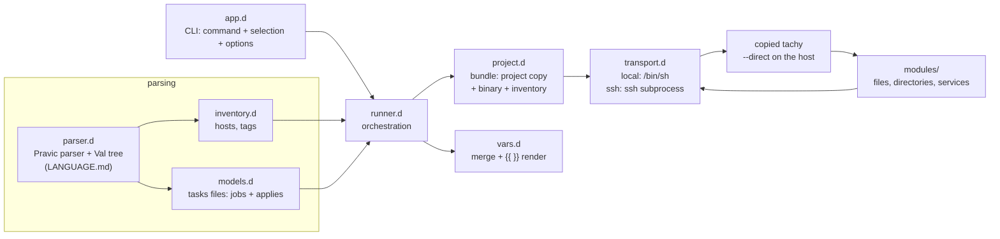

# tachy

Full reference: [DOCUMENTATION.md](DOCUMENTATION.md).

Pravic-driven configuration management for D — a small, boring, Ansible-like
(files, directories, services, compose stacks, git repositories) addressed
by target, written
in Pravic, tachy's own configuration language (see [LANGUAGE.md](LANGUAGE.md)).
tachy applies it to the hosts selected from an **inventory**, over SSH or
locally. The tasks file's parent directory is its **project**: tachy
copies the project — and itself — to each host and runs it there. Current
state is inspected first, and actions run only when reality differs from
the desired one — running twice changes nothing the second time.

The names are a double homage: Pravic is the constructed language of
Anarres in Ursula K. Le Guin's *The Dispossessed*, and the ansible —
the instantaneous interstellar communicator of the same Hainish
novels — gave the Ansible tool its name. *tachy* names the mechanism
inside Le Guin's device: the tachyon, the hypothetical
faster-than-light particle (Greek *tachys*, "swift") science fiction
uses to explain instantaneous communication.

```sh
tachy apply '@web'     # applies main.pravic; its directory is the project
```

## Features

- **Inventory**: hosts with connection details, tags and variables.
- **Tasks files**: `file`, `directory`, `service`, `compose` (plus
  `package`, `group`, `user`, `ensure`, `http`, `repo`, `debug`)
  statements keyed by path,
  unit name, URL or stack dir — the target *is* the statement key. Two
  equivalent forms, group and single.
- **Projects**: the tasks file's parent directory is the project; tachy
  copies it (plus the tachy binary) to a temporary bundle on every host
  and executes the composition there. A tasks file argument may be a
  directory — its `main.pravic` is the entry point — and with no tasks
  file argument, `main.pravic` in the current directory is used.
- **Composition**: tasks files compose other tasks files through
  `apply "path" { bindings }`, which composes at the statement's
  position (source order is the run order — there is no before/after
  split anymore), each apply carrying its own variables; scopes chain
  and flow forward. An entry naming an existing directory uses its
  `main.pravic`, like a directory argument on the command line.
- **Variables** — `vars` statements with precedence and
  `{{ name }}` / `{{ table.key }}` templating, including variables
  referencing other variables (cycle-detected) and a `choose`
  switch/case value for per-scope selection.
- **Selection**: comma-separated host names and `@tag` selectors, after
  the command word; `inventory.pravic` is the default inventory.
- Transports: `local` (`/bin/sh`) and `ssh` (spawns `ssh`; bundles are
  shipped as a tar stream and file content over stdin — the host needs
  nothing but GNU coreutils and tar).
- Check mode (`tachy check`): dry-run that reports would-be changes
  without applying anything. `debug "msg"` prints a templated message
  as a job line — a task that never fails, in apply or check mode.
- Per-command help screens (`tachy help <command>` or
  `<command> -h`; an incomplete invocation shows one too), colored on
  a terminal (`--color` forces), from a micro markup in the help text.
- **Web UI** (`tachy webui`): a local web server that is a graphical
  version of the CLI — projects from config.pravic, apply/check runs
  with the events streaming in live. The interface is embedded in the
  binary (HTML/CSS/JS via `import("...")` — one binary, no framework,
  no asset pipeline).
- **Web docs** (`tachy webdoc`): the full reference served as a
  browsable site on a local web server — one page per section with a
  left menu, generated from the DOCUMENTATION.md embedded in the
  binary (always current for the binary being run); the site shares
  the web console's stylesheet (dark, like the webui).
- **Generate** (`tachy generate`): scaffolding — a new age key pair
  (`generate key <path>`), a commented sample tasks file
  (`generate task <path>`) or a sample project folder
  (`generate project <path>`: inventory, tasks file, config);
  `generate completions bash|zsh|fish` prints the shell completion
  script for the given shell.
- Strict validation everywhere: unknown keys, undefined variables, invalid
  states, duplicate targets, apply cycles, applies escaping the
  project and unknown hosts/tags are reported with file context before
  anything touches a machine.
- Per-host failure isolation: a failing host is dropped from the rest of its
  tasks file; other hosts continue; exit code 1 if anything failed.
- Clean stop: Ctrl-C (SIGINT) or SIGTERM stops dispatching, lets the
  in-flight command die, removes the bundles and prints the summary —
  exit code 128+signal; a second signal kills immediately.

## Build

Requires [DMD](https://dlang.org) and [dub](https://code.dlang.org).

```sh
dub build          # produces ./tachy
dub test           # unit tests for all layers
```

No dependencies at all: Pravic — tachy's own configuration language,
specified in [LANGUAGE.md](LANGUAGE.md) — is parsed by a small
hand-written parser inside tachy; the D standard library is everything
it needs.

## Example usage

A small site setup, applied to everything tagged `web`. The tasks file and
everything it needs live in one **project** directory:

```text
site/
├── main.pravic        # entry point (the default tasks file name)
├── base.pravic        # a reusable building block
└── files/
    └── index.tmpl     # rendered source: template = "files/index.tmpl"
```

**`site/main.pravic`** — composes the base and adds jobs (the group and
single statement forms are equivalent — see below):

```pravic
vars {
    domain = "example.org",
}

apply "base.pravic" {
    site_name = "main",
}

file "{{ doc_root }}/index.html" {
    template = "files/index.tmpl",
    mode = "0644",
}

file "{{ doc_root }}/robots.txt" {
    content = "User-agent: *\n",
    mode = "0644",
}

service nginx {
    state = "started",
    enabled = true,
}
```

**`site/base.pravic`** — a reusable building block

```pravic
var doc_root = "/srv/www"

# templated keys keep their quotes — braces are not bare-key characters
directory "{{ doc_root }}" {
    mode = "0755",
}
```

**`inventory.pravic`** (the default inventory file) — kept in the project or
next to it:

```pravic
vars {                        # global variables, lowest precedence
    site_owner = "tachy",
}

host web1 {
    address = "192.168.1.10"  # default: the host name
    user = "deploy"           # ssh user
    # port = 22               # ssh port (default 22)
    # key  = "~/.ssh/id_ed25519"  # identity file (default: ssh's default)
    tags = ["web", "front"]   # selection: tachy apply '@web' ...
    vars { http_port = 8081 }
}

host web2 {
    address = "192.168.1.11"
    tags = ["web"]
    vars { http_port = 8082 }
}

host buildbox {
    connection = "local"      # manage this machine itself
}
```

Run it — the command word (`apply` or `check`) is followed by the host
selection (a comma-separated list of host names and `@tag`s; `all`
matches everything). A tasks file argument may be a directory (its
`main.pravic` is the entry point); with no tasks file, `main.pravic` in
the current directory is used. Either way, tachy copies the whole project
and itself to each host and executes it there:

```sh
$ cd site && tachy apply '@web'
== main.pravic | hosts: web1, web2
web1 | changed         | directory /srv/www: created directory
web1 | changed         | file /srv/www/index.html: created file
web1 | changed         | file /srv/www/robots.txt: created file
web1 | changed         | service nginx: enabled, started
web2 | changed         | directory /srv/www: created directory
web2 | changed         | file /srv/www/index.html: created file
web2 | changed         | file /srv/www/robots.txt: created file
web2 | changed         | service nginx: enabled, started
-- main.pravic: ok=0 changed=8 failed=0

$ tachy apply '@web'             # second run: nothing to do
-- main.pravic: ok=8 changed=0 failed=0
```

The base's `directory` runs first because its `apply` statement is
declared first — jobs run in source order. Note that the main file's
jobs use `{{ doc_root }}` even though it is defined inside the applied
`base.pravic` — the apply composes above them and its variables flow
forward. Host variables (`http_port`) and global ones (`site_owner`)
travel to each host in a generated one-host inventory inside the
temporary bundle. `template = "files/index.tmpl"` renders that source on
the host with the same scope before it is compared and written; `src`
would copy it verbatim instead.

Drift is detected and repaired — and previewed first with `check`:

```sh
$ echo tampered | ssh deploy@192.168.1.10 tee -a /srv/www/index.html >/dev/null
$ tachy check '@web' main.pravic   # dry run
web1 | changed (check) | file /srv/www/index.html: updated content
-- main.pravic: ok=7 changed=1 failed=0 (check mode, nothing applied)
$ tachy apply '@web' main.pravic   # repair
web1 | changed         | file /srv/www/index.html: updated content
```

Other useful invocations:

```sh
tachy apply '@web' ~/site/main.pravic    # explicit entry file
tachy generate key key.txt               # a new age key pair
tachy generate task main.pravic          # a sample tasks file
tachy generate config config.pravic     # a sample config file
tachy generate project demo           # a sample project folder (inventory, tasks, config)
tachy webui                              # graphical console (random port)
tachy webdoc                             # the docs as a site (random port)
tachy man                                # the full manual, man-page style
tachy version                            # the build date (YY.mm.dd)
```

(All of these assume the project layout above; `tachy apply '@web'` uses
`main.pravic` in the current directory.)

## CLI reference

```
tachy — Pravic-driven configuration management (Ansible-like)

Usage: tachy <command> [options] [<args>...]

Commands:
  apply (a)    Apply the tasks files to the selected hosts
  check (c)    Check mode: report would-be changes without applying anything
  hosts        Inspect hosts: "hosts list [<selection>]", "hosts info <host>"
  generate (g) Write scaffolding: age keys, sample tasks/config/project files, shell completions
  webui        Start a local web console: a graphical version of this CLI
  webdoc       Serve the built-in documentation as a local web site
  man          Print the full manual, unix man-page style
  version (v)  Print the version (the build date, YY.mm.dd)
  upgrade      Upgrade tachy to the latest GitHub release
  help         Show this help, or "tachy help <command>" for one command

Options:
  -i, --inventory PATH  Inventory file (default: inventory.pravic)
  -v, --verbose         Show executed commands, change details and command output (stdout/stderr)
  --direct              Apply tasks files directly in this process, without bundling a project (this is how the copied binary runs on each host)
  --direct-report P     With --direct: write "ok changed failed" counters to P
  --events              Print one JSON event per line on stdout instead of text (machine mode): with --direct, the local run's own events; otherwise the raw events streamed live from each host, wrapped in the controller's fileStart/fileDone events
  --keep-bundle         Keep each host's temporary bundle directory after the run, for inspection (project copy, generated inventory, report)
  --config PATH         Optional config file (the identity entry, imports search paths, webui projects, output format); default: TACHY_CONFIG, then config.pravic in the current directory, then ~/.config/tachy/config.pravic
  --identity PATH       Age identity for { age = ... } inventory vars and file sources marked age = true; supersedes the config file's identity entry. Default: that entry, then AGE_IDENTITY (path or key material), then ~/.ssh/id_ed25519 (age accepts ssh keys)
  --color               Force colored statuses even when stdout is not a tty (forwarded to the run on each host)
  --address ADDR        Address for webui/webdoc to bind (default 127.0.0.1; an IP — use 0.0.0.0 to listen on every interface)
  --port PORT           Port for webui/webdoc to listen on (default: a random port between 10000 and 65534; 0 does the same)
  --no-browser          Do not open the browser window; the bound URL is still printed
  --completion          With hosts list: print selection candidates (all, host names, @tags), one per line, for shell completions
  -y, --yes             With upgrade: skip the y/N confirmation and upgrade unattended
  -h, --help            Show this help

Run "tachy help <command>" for a command's screen, "tachy man" for the full manual.
```
(linux/amd64 only).

### Config (optional)

`config.pravic` is read once at the start of every `apply`/`check`
(and once when the webui server starts). Discovery, first found wins:
`--config PATH` (must exist), the `TACHY_CONFIG` variable (must
exist), `./config.pravic`, then `~/.config/tachy/config.pravic` — with
none present, settings are empty. Today it holds the age `identity`,
the `imports` search paths, the `webui` project list and the `output`
section:

```pravic
identity "key.txt"

imports {
    paths = ["libs", "~/.config/tachy/imports"],
}

webui {
    projects = ["~/Code/site"],
}

output {
    format = "tree",           # "flat" (the default) or "tree"
}
```

The identity and the entries of both lists are `~`-expanded and, when
relative, resolve against the config file's own directory (never the
cwd). `--identity` supersedes the `identity` entry. An `import`
path that does not resolve relative to its defining tasks file is
searched in `paths`, in order; `projects` is what `tachy webui`
offers in the browser (a directory is a project whose entry point is
its `main.pravic`; a plain file is used as the entry point directly).
`output.format` picks the shape of the event output `apply`/`check`
print: `flat` (the default) keeps one `host | status | task` line per
job; `tree` opens a group per host — the host name on its own line —
and indents its job lines beneath it.
`tachy generate config <path>` writes a commented sample.

### Web UI

`tachy webui` starts a local web server on a random port between
10000 and 65534 (the bound URL is printed, and tachy tries to open it
in the local browser — `gio open`, best-effort; `--no-browser` keeps
the browser closed; `--address`/`--port` to change it) that is a
graphical version of the CLI:

- the projects from the `webui` block's `projects` list in
  config.pravic are listed and clickable; missing paths are shown
  struck through;
- pick a host selection (the hosts and `@tag`s of the inventory are
  offered as toggleable chips) and run **Check** or **Apply**;
- the run's progress streams in live: each job line appears as the
  remote executor on the host finishes the job — the page consumes the
  same NDJSON event stream as `--events`, delivered as Server-Sent
  Events; ok/changed/failed counters fold as events arrive, load
  errors and ssh noise show as log lines, and past runs stay
  replayable;
- a verbose toggle unhides the per-job detail lines (executed
  commands).

Each run is just this binary spawned as
`tachy apply|check --events -i <inventory> <selection> <project>`, so
the webui behaves exactly like the equivalent CLI invocation (bundled
mode, bundles cleaned up after each run). The interface — plain
HTML/CSS/JavaScript, no framework, no asset pipeline — is embedded in
the binary at compile time with D's `import("...")`: one binary, no
external files. The server executes real runs and binds to localhost
only by default; anyone who can reach the port can run tachy.

### Web docs

`tachy webdoc` serves this documentation as a small web site (a random
port between 10000 and 65534 by default, like the webui — the URL is
printed and the browser open is attempted unless `--no-browser`; the
same `--address`/`--port` options as the webui): one page per section — the
`##` groups become menu groups carrying their intro, each `###` becomes
a page — with a left menu to
pick one. Internal links are rewritten to point at the page holding
their target. The pages are generated by a small markdown-subset
renderer (headings, fenced code blocks, pipe tables, bullet lists,
inline code/bold/italic/links) from the `DOCUMENTATION.md` embedded in
the binary at compile time, so they always document the binary being
run. The server is read-only and takes no arguments.

Exit code is `1` when any job failed or configuration is invalid, `0`
otherwise — `128 + signal` (130 for Ctrl-C, 143 for SIGTERM) when a
signal stopped the run, which then reports what completed and removes
the bundles before leaving (a second signal skips even that). Multiple
tasks files run in order; a host that fails inside one file is retried
in the next.

## Configuration reference

### Inventory

| Statement | Keys | Meaning |
|---|---|---|
| `host NAME { ... }` | `address`, `user`, `port`, `key`, `connection`, `tags`, `vars` | One host. `connection` is `"ssh"` (default) or `"local"`; `address` defaults to the host name; `tags` drive `@tag` selection. |
| `vars { ... }` / `var NAME = value` | — | Global variables. Entries may be `{ env = "NAME", default = "...", from = ".env" }` to read the controller's environment or a dotenv file, or `{ run = "cmd" }` to capture a command's output (a per-host `vars { ... }` block too). |

### Tasks file

A tasks file is a sequence of statements, one per line (all optional):

| Statement | Target | Entry keys |
|---|---|---|
| `var NAME = value` / `vars { ... }` | — | Variables for this file's jobs and everything it composes. Entries may be `{ env = "NAME", default = "...", from = ".env" }` to read the environment of the process loading the file (the host, in bundled runs), a dotenv file relative to it, or `{ run = "cmd" }` to capture a command's output. A value may also be a `choose` switch/case: `choose "{{ sel }}" { "A" = "one", _ = "other" }` — subject rendered then matched exactly, `_` the mandatory default; var assignations only. |
| `directory PATH { ... }` | path | `state` (default `directory`; also `absent`), `mode`, `owner`, `group` |
| `service UNIT { ... }` | unit | `state` (`started`, `stopped`, `restarted`, `reloaded`, or `enabled` = ensure boot enablement only), `enabled` (bool), `src`/`template` (manage the unit file at `/etc/systemd/system/<unit>`: verbatim copy or rendered template; mutually exclusive), `vars` (local template context, with `template` only; `{ env }`/`{ run }` markers resolve at load like every other var). |
| `repo PATH { ... }` | path | `url` (required: cloned when the path is not a repository, enforced on the `origin` remote otherwise), `type` (only `git`), `branch` (checkout + fast-forward to `origin/<branch>`; mutually exclusive with `tag`), `tag` (detached checkout). Without `branch`/`tag`: existence, origin and fetch only — the working tree is left alone. |
| `compose DIR { ... }` | dir | `file` (required; relative inside `dir`), `state` (`running` default, `stopped`, `absent`), `project` (default: lowercased `dir` basename), `services` (subset; default all), `pull`/`build`/`recreate` policies, `wait` (default `true`) + `wait_timeout`, `timeout`, `remove_orphans` (stopped), `remove_volumes`/`remove_images` (absent). Needs the docker CLI with the compose plugin on the host. |
| `package "mgr:name" { ... }` | `"<manager>:<name>"` | `version` (default `latest`; an explicit version pins it exactly — epoch-qualified, as dpkg reports it), `present` (default `true`; `false` removes). Only `apt` keys are supported. |
| `group NAME { ... }` | name | `state` (default `present`; `absent` removes). |
| `user NAME { ... }` | name | `group` (primary; default: a group named after the user), `groups` (supplementary, additive only), `shell` (default `/bin/sh` at creation), `comment`, `create_home` (default `true`, creation only), `home` (default `/home/<name>` at creation), `state` (default `present`; `absent` removes), `remove_home` (default `false`, with `state = "absent"`). |
| `ensure "name" { ... }` | name | `run` (required), `args` (array of strings appended to `run`, one element one argument), `exit_status` (integer, `{ not = N }`, or `{ cond = "OP N" }`; default 0), `output` (string, `{ equals = "..." }`/`{ contains = "..." }`/`{ matches = "..." }`, composed: several keys AND together, `{ not = <pattern> }`, `{ any }`/`{ all }`/`{ none }` arrays) |
| `http URL { ... }` | url | `type` (any HTTP method, default `GET`), `headers` (array of `"Name=Value"`), `data` (body, sent verbatim), `code` (expected status, default `200`), `output` (body assertion, `ensure`'s shapes), `timeout` (seconds, default `10`). Plain `http://` only; queried by tachy itself (no curl) — on the host in bundled runs, from the controller with `--direct`; a check by nature: runs in check mode, never `changed`. |
| `assert "name" { ... }` | name | `value` (required, templated) plus the expectation keys — `ensure`'s `output` shapes: `equals`/`contains`/`matches`, composed with `not`/`any`/`all`/`none`; several keys AND together, at least one required. Tests rendered variables on the controller — no command runs, no host contact; a check by nature (runs in check mode, never `changed`). |
| `debug "message"` | message | No attributes: prints the (templated) message as a job line — never fails, never `changed`, runs in check mode too. |
| `apply "path" { bindings }` | path | Composes another tasks file **at the statement's position**, carrying its own variables: the binding's entry keys, or the same grouped in a `vars { ... }` sub-block. Bindings resolve `{ env }`/`{ run }` markers at load like every other var. A path naming an existing directory uses its `main.pravic`, like a directory CLI argument. |
| `import "path"` | path | Bundled mode only: an external file or directory (absolute, or relative to the defining tasks file) copied into the bundle next to the project copy under its base name — `import "tasks/install_gogs"` → `project/install_gogs` — so `src`/`template`/`run` can use it on the host. No parameters — the braces are optional; destinations colliding with project content or another import are load-time errors; a path that does not resolve relative to its defining file is searched in the `config.pravic` `imports` paths. An apply naming the import destination itself works too (`apply "neovim" { }` → its `main.pravic`); entries under a destination that are missing locally defer to the host (the inner run composes them, bindings included; a directory entry resolves to its `main.pravic`, as everywhere). |

Both forms of a directive are equivalent — the same entry, spelled once
each way:

```pravic
file /tmp/myfile {                # single form: one entry, one statement
    owner = "root",
    mode = "0600",
}
```

```pravic
files {                           # group form: the plural keyword, keyed entries
    /tmp/myfile {
        owner = "root",
        mode = "0600",
    }
}
```

Unquoted keys are opaque strings, not dotted paths: any character except
whitespace, structural punctuation, quotes, `#`, `\` and control
characters, so `file /etc/nginx.conf { ... }` and
`package apt:nginx { ... }` need no quotes. Keys containing `{{ ... }}`
templates keep their quotes. Blocks are natively multi-line — entries
are separated by commas and/or newlines, and a trailing comma is
allowed. An instruction with no attributes may omit the braces
(`directory /tmp/two` is `directory /tmp/two { }`).

Idempotency semantics:
- `file` + `content`/`src`/`template`: compares current content,
  writes only on difference. `content` is templated inline; `src` copies
  the named file verbatim; `template` renders the named file's
  `{{ vars }}` with the host's scope first (an entry `vars { ... }`
  table is a local template context merged over it, local values
  winning — with `template` only, like `service`; its `{ env }`/`{ run }`
  markers resolve at load like every other var of the file). The three
  are mutually exclusive sources. `state = "link"` makes the key a
  symlink to `src`; `state = "absent"` removes whatever is there.
- `file` + `line`/`block`: ensures a line (or a contiguous block of
  lines) is present — whole-line matches anywhere in the file; appends
  it (newline-terminated) only when missing. `line` and `block` are
  mutually exclusive, and exclusive with `content`/`src`/`template`. Without
  any of them, only ensures existence.
- `package`: keys are `"<manager>:<name>"` (only `apt`). Presence is
  probed read-only with `dpkg-query`; mutations run
  `apt-get install -y` / `remove -y` with `DEBIAN_FRONTEND=noninteractive`
  so installs never block on prompts. `version = "latest"` (the default)
  only ensures presence — newer candidates are not looked for; an explicit
  version is compared exactly against dpkg's `${Version}` and repaired
  with `--allow-downgrades`.
- `group`: `groupadd` when missing, `groupdel` when present and
  `state = "absent"`. Removing a group that is still a user's primary
  group fails with a hint (remove the user first — e.g. in an earlier
  tasks file).
- `user`: shadow-utils accounts. Missing users are created with the
  declared attributes (creation defaults: shell `/bin/sh`, home
  `/home/<name>`, home created); existing users have their *explicitly
  set* attributes enforced — primary group, shell, comment and home
  drift is repaired with a single `usermod` (`-m -d` moves the home).
  `groups` is additive: missing memberships are added, others kept.
  `state = "absent"` runs `userdel` (`-r` with `remove_home = true`).
  Existence is probed with `getent`, so the target needs glibc
  alongside coreutils.
- `service`: queries `systemctl is-active` / `is-enabled` and acts only
  on mismatch (`started`/`stopped`/`enabled`); `restarted`/`reloaded`
  always act. `state = "enabled"` ensures boot enablement without touching
  the running state. `src` or `template` manage the unit file itself at
  `/etc/systemd/system/<unit>` (`.service` appended when the name has no
  suffix): rendered with the host scope plus the entry's local `vars`
  (`template`), or copied verbatim (`src`); checksum-compared, written and
  `daemon-reload`ed on drift — a running service is not restarted (use
  `state = "restarted"` to apply a new unit).
- `compose`: Docker Compose stacks keyed by project directory. `running`
  probes every selected service read-only — container running, healthy
  (when a healthcheck is defined) and its `com.docker.compose.config-hash`
  label equal to the canonical `docker compose config --hash` — and runs
  `up --detach` (with the `pull`/`build`/`recreate`/`wait` policy flags)
  only on drift. `stopped` runs `compose stop`, preserving containers and
  data (`remove_orphans = true` drops containers whose service left the
  model, through the container engine). `absent` runs
  `down --remove-orphans` (plus `--volumes` / `--rmi all` on request) and
  is a no-op when nothing of the project exists — the compose file is only
  read when something has to run.
- `repo`: git repositories keyed by checkout path. A missing repository
  is cloned (the declared branch or tag carried on the clone); an
  existing one gets its `origin` remote added or retargeted to `url`,
  then `git fetch --prune origin` refreshes the remote-tracking refs.
  A declared `branch` is checked out (created tracking `origin/<branch>`
  when it does not exist locally) and fast-forwarded — only when HEAD
  is an ancestor of the remote branch; a diverged branch fails the host
  instead of being rewritten. A `tag` checks the tag's commit out
  detached. Without `branch`/`tag`, existence, origin and fetch are the
  whole contract — the working tree is never touched. Check mode runs
  the same probes (fetch included: it only moves remote-tracking refs)
  and reports the would-be clone/retarget/checkout/fast-forward.
- `ensure`: runs `run` on the host and checks it — `exit_status`
  accepts an integer, `{ not = N }` or `{ cond = "OP N" }` with `OP`
  one of `==`, `!=`, `<`, `<=`, `>`, `>=` (default `0`); `output`
  accepts a string (exact match on the trimmed output),
  `{ equals = "..." }`, `{ contains = "..." }` or `{ matches = "regex" }`
  — patterns compose:
  several keys in one table all must hold, `{ not = <pattern> }`
  negates one pattern, `{ any = [ ... ] }` holds when one listed
  pattern does, `{ all = [ ... ] }` when all do and `{ none = [ ... ] }`
  when none do. `args` takes an
  array of strings appended to the command, space-separated: each
  element is shell-quoted, so one element stays one argument even with
  spaces inside, and entries are templated like every string. A passing job
  reports `ok` (never `changed`); a failed assertion fails the host
  with the actual status/output. Ensure jobs are checks by nature:
  they run even in check mode, so keep mutating commands out of them.
  The command runs with the defining tasks file's directory as its
  working directory, so relative paths (scripts, data files) resolve
  next to the file that declares the job.
- `http`: submits one HTTP request and checks the answer — `type` is any
  HTTP method (default `GET`), `headers` an array of `"Name=Value"`
  strings, `data` the body sent verbatim, `code` the expected status
  (default `200`), `output` the body assertion (the same shapes
  `ensure`'s `output` accepts) and `timeout` the whole-query budget in
  seconds (default `10`). Plain `http://` only; the query is issued by
  tachy itself (no curl on the host) — on the managed host in bundled
  runs, from the controller with `--direct`. Like `ensure` these jobs
  are checks by nature: they run even in check mode and never report
  `changed`.
- `assert`: tests a rendered value against `ensure`'s `output` patterns
  on the controller — `value` is templated against the host's effective
  variables, the expectation keys are the same shapes (`equals`/
  `contains`/`matches`, composed with `not`/`any`/`all`/`none`), and no
  command runs and no host is contacted. Variables only: probe host
  state with `ensure`. A check by nature: runs in check mode, never
  reports `changed`.

Execution order is the source order: there is no fixed directive order
and no sorting — jobs execute in the order their statements appear, and
an `apply` composes its file at the statement's position. What a
fixed order used to guarantee is the author's to express: a `directory`
statement above the files that live in it (a file may live inside a
directory the same file manages — including the compose file a
`compose` entry uses), a user's primary `group` above the `user`, a
health `ensure` simply between the statements it checks. `var`/`vars`
and `import` statements are not jobs — they take effect file-wide
regardless of position.

Managing the same (kind, target) twice anywhere in a composition is a
load-time error.

A project must be self-contained: applies escaping the tasks file's
parent directory are a load-time error, and `file.src` resolves inside
the copied project (a `src` outside the project cannot be read on the
host) — the `import` statement is the sanctioned way to pull external
files into the bundle. Bundles are created with `mktemp -d` under
`TMPDIR` (or `/tmp`)
on the host and removed when the run finishes — `--keep-bundle` leaves
them in place and prints their location, for inspection.

### Variables and templating

Precedence, lowest to highest, scopes chaining through the composition
graph:

```
inventory vars  <  host vars  <  outer file vars  <  apply bindings
                <  composed file's own vars
```

The resulting scope flows forward: statements see everything the
applies above them contributed (they compose first, at their
position). An apply's binding keys are its variable binding; a
`vars { ... }` sub-block in the binding is an equivalent, grouped
spelling:

```pravic
apply "files.pravic" {
    vars { three = "three" }
}
```

Binding the same variable both directly and under `vars` is an error.
Bindings resolve their `{ env }`/`{ run }` markers at load like every
other var of the defining file, before the composed file is read.
Every string in job parameters (including statement keys) is rendered
before execution; `{{ expr }}` accepts dotted paths into nested tables.
Unknown variables and reference cycles are hard errors.
`{{ inventory_hostname }}` is always the current host's name. Deep merge:
nested tables merge key by key; arrays and scalars replace.

Environment variables can be stored into tachy's variables with an
`{ env = "NAME" }` entry, replaced at load time by the variable's value.
An optional `default` covers an unset variable — it only errors when
there is no value and no default. A `from = "<path>"` attribute reads
the value from a dotenv file instead of the process environment:

```pravic
vars {
    api_token = { env = "API_TOKEN" },
    log_level = { env = "LOG_LEVEL", default = "info" },
    secret_var = { env = "SECRET_VAR", from = ".env" },   # KEY=VALUE lookup in .env
}
```

The `from` path is relative to the file declaring the vars (the
inventory or tasks file). The dotenv format is `KEY=VALUE` lines with
`#` comments, blank lines, an optional `export ` prefix and single-line
quoted values (double quotes process the usual escapes, single quotes
are literal); an empty value is a value, later keys win, and anything
else is an error naming file and line. The `default` still applies —
it covers a key the file does not define.

Inventory vars (global and per-host) resolve in the controller's
environment; tasks-file vars resolve in the environment of the
process that loads them — the host, in bundled runs, so the same
project can pick up per-host values. With `from`, the file is read in
that same place: for bundled tasks files it must live inside the
project (the bundle copies it along). A set-but-empty variable resolves
to the empty string (the default only covers an unset variable). Nested
tables are walked; arrays and scalars pass through unchanged.

A `{ run = "<command>" }` entry captures a command's output instead:
stdout by default, stderr with a `stream = "stderr"` attribute.

```pravic
vars {
    host_ip = { run = "hostname -I" },
    diag = { run = 'echo "error" >&2', stream = "stderr" },
}
```

The command runs through `/bin/sh -c` in the declaring file's directory
(relative paths resolve next to it, like `ensure` jobs) and sees the
environment of the process loading the file, at the same place and time
an `{ env }` entry resolves: on the controller for inventory vars, on
the host for bundled tasks-file vars — whose controller-side validation
load also executes it once on the controller, so keep it read-only or
idempotent (it runs in check mode too). One trailing newline is
stripped; a failing command, or output that is not valid UTF-8, is a
load-time error naming the variable, the command and the status. `run`
cannot combine with `env`, `default`, `from` or `age`.

### Secrets (age)

Inventory vars may hold age-encrypted entries — replaced by the
decrypted content of the named file (path relative to the inventory;
one trailing newline is stripped, so `echo secret | age -r … > f.age`
files work as-is):

```pravic
vars {
    db_password = { age = "secrets/db_password.age" },
}
```

Decryption happens **on the controller** — the identity never travels
inside a bundle; the decrypted value reaches hosts the same way every
resolved inventory var does (through the generated per-host inventory,
removed with the bundle). The identity comes from `--identity PATH`,
the `identity` entry in config.pravic (superseded by the flag), the
`AGE_IDENTITY` environment variable (an existing file path, or raw
key material — fed to age on stdin, never written to disk), or by
default `~/.ssh/id_ed25519` (age accepts ed25519 ssh keys natively, so
the deployment key can double as the decryption key; encrypt with
`age -R ~/.ssh/id_ed25519.pub`).

`{ age }` markers are inventory-only (tasks-file vars resolve on
hosts, which hold no identity) and cannot combine with
`env`/`default`/`from`/`run`. Decryption failures are load-time errors naming
the entry and file; plaintext must be UTF-8 — binary secrets do not
fit variables (see below). Keep secrets out of `check` commands:
`-v` details would display them.

Files get the binary-safe spelling: a `file` source marked `age = true`
is decrypted on the controller and deployed byte-exact — keyrings, TLS
keys, anything that is not text. The plaintext is not templated and
nothing is stripped.

```pravic
file /etc/tls/web1.key {
    src = "secrets/web1.key.age"
    age = true
    mode = "0600"
}
```

In bundled runs the controller decrypts the source while building each
host's temporary bundle and writes the plaintext over the ciphertext
copy (the identity never travels — the same trust the generated
inventory already extends to decrypted vars; `--keep-bundle` retains
it). With `--direct` the source is decrypted in-process with the same
identity resolution. The path resolves like `src`, must live inside
the project, and requires `state = "file"`. Secrets inside applies
deferred to an `import` destination work too: the controller mirrors
the bundle's layout (project plus landed imports, as symlinks) and
shadow-composes the entry file there to collect them.

## Architecture



Two levels of tachy run per invocation: the controller validates the
composition, then for each host deploys a temporary bundle (project copy,
binary copy, generated one-host inventory with the host's effective
variables) and executes the copied binary there; the on-host copy applies
every job through a local transport and reports per-job lines plus an
"ok changed failed" counter file the controller aggregates. `--direct`
skips the bundling and runs jobs in-process (that is what the on-host
copy runs as).

1. **Parse & validate** — every Pravic file is parsed by `parser.d` (a
   hand-written parser; see LANGUAGE.md) into a uniform `Val` tree plus
   its ordered statement list (datetimes do not exist in Pravic).
   `inventory.d` and `models.d` validate structure, keys, states,
   duplicate targets, apply cycles and applies escaping the project
   up front, so a typo fails before any host is contacted — and every
   `{{ ... }}` reference (template files included) is dry-rendered
   against each selected host's effective variables, so an undefined
   variable fails on the controller, naming the entry and the host.
   A tasks file flattens into an ordered `Job[]`, each job carrying
   its variable overlay (the apply-chain scope it was defined in).
2. **Select** — `runner.d` resolves the selection argument (host names,
   `@tags`, `all`) through the inventory; unknown names or tags error with
   the list of the known ones.
3. **Bundle** — per host, `project.d` deploys the temporary bundle through
   the host's transport: a tar stream of the project, the running binary
   via `cat > tachy` + `chmod`, and a generated one-host inventory
   (host variables serialized back to Pravic). Bundles are cached per
   (host, project) and removed at the end of the run.
4. **Execute** — the controller runs the bundled binary on the host
   (`cd project && tachy --direct ...`), which renders each job's
   parameters against the host scope and dispatches to its module
   (`filemod` / `servicemod` / `ensuremod`) with a `TaskContext` (local
   transport, check-mode flag, host name, defining file's dir for
   relative `src`).
   Modules express everything as POSIX shell commands; `transport.d`
   runs them and returns captured stdout/stderr/exit-status. File
   content is streamed through stdin (`cat > path`). The inner run's
   per-job lines are relayed and its counters aggregated from the report
   file. The `check` command lets modules run read-only probes but
   blocks mutations; the bundle itself is scaffolding and is still
   deployed and removed in check mode.

Design notes:

- **One command language.** All state inspection (`stat -c '%F|%a|%U|%G'`,
  `systemctl is-active`, `cat`) and mutation (`mkdir`, `chmod`, `chown`,
  `ln`, `systemctl start`, …) are shell commands built with strict
  single-quoting (`shQuote`), so local and remote hosts share one code path
  and a GNU coreutils Linux target is the only remote assumption.
- **Failures are contained.** Any exception on a host (unreachable SSH,
  failed bundle deployment, failed command, render error) marks that host
  failed for the current tasks file and prints the failing job; remaining
  hosts continue.
- **Boring subprocess plumbing.** `std.process` with explicit pipes; stderr
  is drained on a thread so large stdout cannot deadlock; stdin is fed and
  closed for `runWithInput`; the project archive is produced by a local
  `tar` capturing stdout only.
- **No daemon, no agent versions.** The binary that runs on each host is
  a copy of the controller's own executable, so controller and hosts are
  always in lockstep (and must share the platform).

Source layout:

```
source/app.d                 CLI entry: command word, options, help, exit codes
source/tachy/
  errors.d                   TachyError (user-facing failures)
  parser.d                   Pravic parser (LANGUAGE.md grammar)
  value.d                    Val tree, statement types, validated accessors
  vars.d                     deepMerge, {{ }} rendering, cycle detection
  inventory.d                hosts/tags model, selection, var resolution
  models.d                   tasks files: jobs, applies, scope chaining
  project.d                  bundles: project + binary + generated inventory
  transport.d                Transport interface, local/ssh, shell helpers
  signals.d                  SIGINT/SIGTERM: cooperative stop, child registry
  runner.d                   orchestration: bundled and direct modes
  http.d                     minimal HTTP/1.1 client (the http directive)
  generate.d                 the generate command: age keys, sample files
  config.d                   optional config.pravic: identity, imports
                             search paths, webui projects
  modules/
    package.d                registry, TaskContext/TaskResult, shared helpers
    filemod.d                files / directories / links / absent
    servicemod.d             systemd services
    accounts.d               groups / users (shadow-utils, getent probes)
    packagemod.d             package installs/removals (apt via dpkg-query)
    ensuremod.d               shell command ensures (exit status / output)
    assertmod.d              variable assertions (ensure's output shapes)
    httpmod.d                http checks (status / body assertions)
    composemod.d             Docker Compose stacks (config-hash probes)
    repomod.d                git repositories (clone, origin, fetch/checkout sync)
    fake.d                   scripted transport (unit tests only)
```

Testing: `dub test` covers the Pravic parser, merging/templating (including
cycles), inventory selection and precedence, tasks-file parsing (both
forms, apply layering, duplicate and cycle errors), quoting and
process plumbing, the file module against the real local filesystem, the
service module against a scripted transport, Pravic re-serialization of
host variables, and full bundle deploy/remove over the local transport —
no systemd required for tests.

## Editor syntax

`syntax/pravic.vim` is a Vim/Neovim syntax file for Pravic: directives
with the parser's own keyword boundary (`vars-foo` stays a key), keys
and targets, strings with `{{ ... }}` templates, TOML-lexical numbers,
booleans and comments. Copy it to `~/.vim/syntax/` (Neovim:
`~/.config/nvim/syntax/`) and make the editor detect the filetype once:

```vim
autocmd BufNewFile,BufRead *.pravic setfiletype pravic
```

From a checkout, `mise run syntax` does both for the current user
(the Neovim path honors `XDG_CONFIG_HOME`).

## Limitations

- linux/amd64 only: the binary copied to each host is the controller's own
  executable. Hosts also need GNU tar in addition to GNU coreutils and
  systemd, and a `TMPDIR` (or `/tmp`) that allows executing copied
  binaries.
- Targets must be Linux with GNU coreutils and systemd (the `service`
  directive errors clearly on non-systemd hosts).
- `compose` needs the `docker` CLI with the compose plugin on the host
  (and a reachable container engine); it errors clearly when either is
  missing.
- SSH runs `ssh` with `BatchMode=yes` and
  `StrictHostKeyChecking=accept-new`; there is no password auth, agent
  forwarding, sudo escalation or parallelism (hosts run sequentially).
- `file` with `content` follows symlinks when comparing/writing (no
  `follow`/`force` knobs yet); `mode`/`owner` are not applied to symlinks;
  `src` copies files verbatim — use `template = <path>` to render them.
